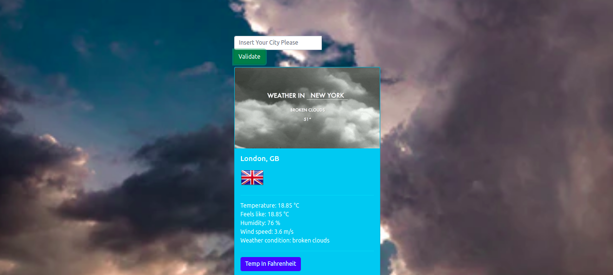

## Weather App

>This is a weather app that pulls from the OpenWeatherMap API to allow users to search for and view the forecast in cities worldwide

## Built With 

- JavaScript, HTML5, Sass and Bootstrap

## Getting Started

To get a local copy up and running follow these simple example steps.

- `git clone git@github.com:FrederickMih/WEATHER-APP.git`
- `cd weather-app`
- `npm install`
- `npm start`
- open `dist/index.html` 

### Prerequisites

- Get a browser like Chrome and Firefox in their most recent versions
- 

### Install

- Install VSCode or any code editor you prefer

# Author

👤 **Mih Frederick**

## 🤝 Contributing

Contributions, issues and feature requests are welcome!

Feel free to check the [issues page](https://github.com/FrederickMih/WEATHER-APP/issues).

## Acknowledgments

- OpenWeather API
- GIPHY API

## Show your support

Give a ⭐️ if you like this project!

## 📝 License

Copyright 2021 Mih Frederick

Permission is hereby granted, free of charge, to any person obtaining a copy of this software and associated documentation files (the "Software"), to deal in the Software without restriction, including without limitation the rights to use, copy, modify, merge, publish, distribute, sublicense, and/or sell copies of the Software, and to permit persons to whom the Software is furnished to do so, subject to the following conditions:

The above copyright notice and this permission notice shall be included in all copies or substantial portions of the Software.

THE SOFTWARE IS PROVIDED "AS IS", WITHOUT WARRANTY OF ANY KIND, EXPRESS OR IMPLIED, INCLUDING BUT NOT LIMITED TO THE WARRANTIES OF MERCHANTABILITY, FITNESS FOR A PARTICULAR PURPOSE AND NONINFRINGEMENT. IN NO EVENT SHALL THE AUTHORS OR COPYRIGHT HOLDERS BE LIABLE FOR ANY CLAIM, DAMAGES OR OTHER LIABILITY, WHETHER IN AN ACTION OF CONTRACT, TORT OR OTHERWISE, ARISING FROM, OUT OF OR IN CONNECTION WITH THE SOFTWARE OR THE USE OR OTHER DEALINGS IN THE SOFTWARE.